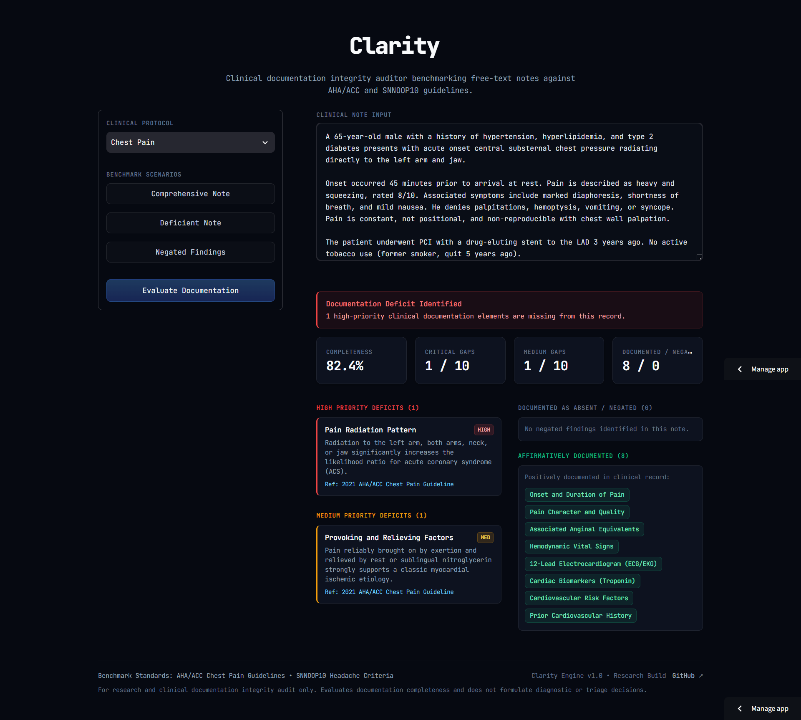
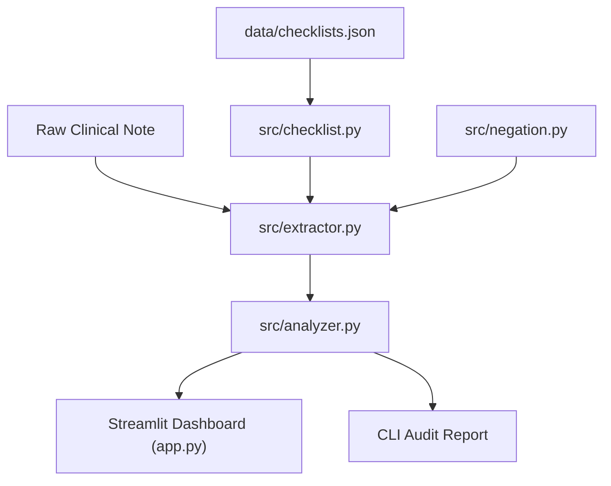

<div align="center">

# Clarity
**Clinical Documentation Integrity & Guideline Audit Engine**

<p>
  An evidence-based clinical documentation integrity engine that audits free-text medical records against authoritative clinical society guidelines to detect documentation omissions without diagnosing patients.
</p>

[](https://www.python.org/)
[](https://clarity-3sdzzb4ebw9kkq92j7x5dq.streamlit.app)
[](https://docs.pytest.org/)
[]()
[](LICENSE)

<p>
  <strong><a href="https://clarity-3sdzzb4ebw9kkq92j7x5dq.streamlit.app" target="_blank" rel="noopener noreferrer">Live Demo</a></strong>
</p>

<a href="https://clarity-3sdzzb4ebw9kkq92j7x5dq.streamlit.app" target="_blank" rel="noopener noreferrer">
  
</a>

</div>

---

> [!CAUTION]
> **Research & Educational Demo Only**: Clarity is not a diagnostic tool or CDSS. It solely audits documentation completeness against codified checklists and must never be used in active clinical care.

---

## Executive Overview

In acute and emergency care, incomplete clinical documentation can delay proper diagnosis and create patient safety risks. While Large Language Models (LLMs) are often suggested for clinical text, their hallucinations, unpredictable latency, and high costs make them unreliable for strict audit compliance.

**Clarity** provides a fast, deterministic audit engine that checks free-text clinical notes against standard medical guidelines in $<10\text{ ms}$. It produces a clear documentation integrity report:
- 📊 **Completeness Score (%):** Weighted coverage of required clinical items.
- 🚨 **Documentation Gaps:** Missing high- and medium-priority items paired with their clinical rationale.
- 🔍 **Documented Findings:** Clear separation between positive findings and explicitly denied/negative symptoms.

---

## Key Capabilities

- **Guideline-Grounded Checklists**: Audits clinical notes against official medical standards:
  - **2021 AHA/ACC Guidelines** for acute chest pain.
  - **SNNOOP10 Red Flags** for acute headache.

- **Smart Negation Detection**: Accurately catches denied symptoms (e.g., *"denies shortness of breath"*, *"no jaw pain"*), ensuring documented negatives are not misclassified as omissions.

- **Weighted Clinical Scoring**: Assigns higher priority to urgent, life-threatening items (`HIGH` = 2 pts, e.g., ECG, troponin) over routine background elements (`MEDIUM` = 1 pt).

- **Fast & Deterministic**: Runs locally in $<10\text{ ms}$ with reproducible results—no GPUs, external APIs, or heavy ML models required.

- **Interactive Streamlit UI**: A clean, dark-mode dashboard built entirely with Streamlit for fast, real-time clinical review.

---

## Codified Clinical Guidelines

Checklists are stored in structured JSON (`data/checklists.json`). Each condition includes 10 clinical parameters with designated priority tiers (`HIGH` = 2 pts, `MEDIUM` = 1 pt) and medical rationales based on established society guidelines.

### 1. Acute Chest Pain (`chest_pain`)
*Guideline Reference: 2021 AHA/ACC Guideline for the Evaluation and Diagnosis of Chest Pain*

| Parameter | Priority | Weight | Clinical Rationale |
| :--- | :---: | :---: | :--- |
| **Onset & Duration** | `HIGH` | 2 pts | Evaluates ischemia acuity and eligibility for time-sensitive reperfusion (PCI). |
| **Pain Character & Quality** | `HIGH` | 2 pts | Distinguishes ischemic pressure/tightness from pleuritic, muscular, or GI causes. |
| **Radiation Pattern** | `HIGH` | 2 pts | Radiation to arms, neck, or jaw significantly increases acute coronary syndrome likelihood. |
| **Associated Anginal Symptoms** | `HIGH` | 2 pts | Diaphoresis, dyspnea, and nausea often act as anginal equivalents in high-risk patients. |
| **Hemodynamic Vital Signs** | `HIGH` | 2 pts | Identifies acute shock, hypertensive crisis, or severe hypoxia requiring urgent stabilization. |
| **12-Lead Electrocardiogram (ECG)** | `HIGH` | 2 pts | Mandatory within 10 minutes of presentation to detect STEMI. |
| **Cardiac Biomarkers (Troponin)** | `HIGH` | 2 pts | High-sensitivity troponin is essential to confirm or exclude acute myocardial injury. |
| **Provoking & Relieving Factors** | `MEDIUM` | 1 pt | Pain brought on by exertion and relieved by rest or nitroglycerin supports ischemic etiology. |
| **Cardiovascular Risk Factors** | `MEDIUM` | 1 pt | Hypertension, diabetes, smoking, and lipids inform pre-test probability scoring. |
| **Prior Cardiac History** | `MEDIUM` | 1 pt | Known coronary disease or prior intervention elevates risk for recurrent events. |

### 2. Acute Headache (`headache`)
*Guideline Reference: SNNOOP10 Red Flag Criteria for Secondary Headache (International Headache Society)*

| Parameter | Priority | Weight | Clinical Rationale |
| :--- | :---: | :---: | :--- |
| **Sudden / Thunderclap Onset** | `HIGH` | 2 pts | Reaching peak within 1 minute is the cardinal warning sign for subarachnoid hemorrhage. |
| **Fever & Meningismus** | `HIGH` | 2 pts | Nuchal rigidity with fever raises immediate concern for meningitis or encephalitis. |
| **Focal Neurologic Deficits** | `HIGH` | 2 pts | Motor, sensory, or cranial nerve deficits point toward stroke, bleed, or mass lesion. |
| **Papilledema** | `HIGH` | 2 pts | Optic disc edema indicates raised intracranial pressure requiring emergent neuroimaging. |
| **Systemic Disease (Cancer / HIV)** | `HIGH` | 2 pts | Elevated risk for brain metastases, abscesses, or opportunistic CNS infections. |
| **New Onset Age > 50** | `MEDIUM` | 1 pt | New headache onset in older adults raises concern for giant cell arteritis or mass. |
| **Pattern Change / Progression** | `MEDIUM` | 1 pt | Escalating severity or a marked shift from usual pattern suggests secondary headache. |
| **Positional or Valsalva Triggers** | `MEDIUM` | 1 pt | Worsening with cough, posture, or straining suggests CSF leaks or posterior fossa lesions. |
| **Analgesic Medication Overuse** | `MEDIUM` | 1 pt | Frequent pain-medication use can cause chronic medication overuse headaches. |
| **Pregnancy / Postpartum Status** | `MEDIUM` | 1 pt | Increases risk of preeclampsia/eclampsia, cerebral venous thrombosis, and apoplexy. |

---

## Audit & Scoring Methodology

### 1. Extraction Pipeline
Clarity analyzes free-text clinical notes in three deterministic steps:

1. **Keyword Matching:** Scans the note for clinical terms and synonyms defined in the checklist.
2. **Clause-Bounded Negation (`src/negation.py`):**
   - Inspects up to 6 words preceding a matched keyword for negation triggers.
   - Strictly terminates at clause boundaries (`.`, `!`, `?`, `;`, newline) so negation never spills across sentences.
   - Supported triggers: `denies`, `denied`, `denying`, `no`, `without`, `negative for`, `ruled out`, `not`, `absence of`.
3. **Status Classification:**
   - **`found`**: Documented affirmatively $\rightarrow$ awards completeness points.
   - **`negated`**: Explicitly documented as absent or denied $\rightarrow$ tracked as a documented negative finding (0 pts).
   - **`missing`**: Omitted from the note $\rightarrow$ flagged as an audit deficit (0 pts).

### 2. Completeness Scoring

$$\text{Score (\%)} = \left( \frac{\text{Earned Points}}{\text{Total Possible Points}} \right) \times 100$$

- **High Priority (`HIGH`) = 2 points**: Life-threatening parameters (e.g., ECG, troponin, thunderclap onset).
- **Medium Priority (`MEDIUM`) = 1 point**: Key contextual factors and background history.
- Explicitly negated items are tracked separately in the audit report rather than penalized or falsely scored.

---

## System Architecture

### Repository Structure

```text
Clarity/
├── data/
│   ├── checklists.json       # Codified clinical guidelines (AHA/ACC, SNNOOP10)
│   └── ground_truth.json     # Curated annotations for 60 benchmark checkpoints
├── src/
│   ├── checklist.py          # Schema validation & checklist loader
│   ├── negation.py           # Clause-bounded negation sliding-window detector
│   ├── extractor.py          # Keyword matcher & status classifier
│   ├── analyzer.py           # Weighted completeness calculation & audit report
│   ├── evaluate.py           # Ground-truth evaluation metrics & confusion matrix
│   └── sample_notes.py       # 6 standardized clinical test fixtures
├── tests/                    # Test suite (12 automated unit tests)
└── app.py                    # Interactive Streamlit review dashboard
```

### Data Flow



1. **Guideline Ingestion (`checklist.py`)**: Loads and validates condition checklists, keyword dictionaries, and clinical priorities from `data/checklists.json`.
2. **Extraction & Negation (`extractor.py` & `negation.py`)**: Matches note text against keywords and inspects sentence boundaries to isolate denied symptoms from affirmed findings.
3. **Audit Scoring (`analyzer.py`)**: Calculates weighted completeness percentage (`HIGH` = 2, `MEDIUM` = 1) and groups missing items by clinical priority.
4. **Presentation**: Formats the final audit report for both the interactive **Streamlit Dashboard** (`app.py`) and the CLI.

---

## Quickstart

### 1. Installation

```bash
git clone https://github.com/mariiammaysara/Clarity.git
cd Clarity
pip install -r requirements.txt
```

### 2. Launch the App

```bash
streamlit run app.py
```
Open `http://localhost:8501` to access the interactive clinical audit dashboard.

### 3. Run Tests & Evaluation

```bash
# Run all 12 automated unit tests
pytest -v

# Run benchmark evaluation against ground truth
python -m src.evaluate

# Run a sample note audit via CLI
python src/analyzer.py
```

---

## Benchmark Clinical Scenarios

Clarity includes 6 calibrated clinical fixtures in `src/sample_notes.py` representing three realistic documentation profiles for each condition:

| Condition | Scenario ID | Documentation Profile | Expected Audit Finding |
| :--- | :--- | :--- | :--- |
| **Chest Pain** | `cp_complete` | Complete ED note with full ACS workup | **100% Completeness** • Zero deficits |
| | `cp_incomplete` | Hurried clinic note lacking ECG, troponin, and vitals | **High-Priority Alerts** flagged |
| | `cp_negated` | Note explicitly denying radiation, dyspnea, and CAD | **Documented Negatives** isolated (0 pts) |
| **Headache** | `ha_complete` | Complete note with full neurological & red-flag exam | **100% Completeness** • Zero deficits |
| | `ha_incomplete` | Brief note omitting onset speed, fever, and papilledema | **Critical Red Flags** flagged |
| | `ha_negated` | Note explicitly denying thunderclap onset and deficits | **Documented Negatives** isolated (0 pts) |

---

## Design Decisions

### 1. Deterministic Engine vs. Generative LLMs
- **Decision**: Built a rule-based audit engine instead of prompting probabilistic Large Language Models.
- **Rationale**: Medical documentation audits require 100% reproducible, explainable results. Generative models risk hallucinations, stochastic scoring, latency spikes, and privacy concerns.
- **Impact**: Instant execution ($<10\text{ ms}$), zero API costs, and fully inspectable audits.

### 2. Weighted Clinical Scoring (2:1 Ratio)
- **Decision**: Assigned 2 points to `HIGH` priority parameters and 1 point to `MEDIUM` priority parameters.
- **Rationale**: In acute triage, omitting critical life-threat rule-outs (e.g., troponin or ECG in chest pain) carries far higher risk than missing background history.
- **Impact**: Scores reflect clinical urgency rather than treating all checklist items equally.

### 3. Clause-Bounded Negation Detection
- **Decision**: Decoupled keyword matching from negation detection using a 6-word window bounded by clause terminators (`src/negation.py`).
- **Rationale**: Patients frequently report absent symptoms (e.g., *"denies shortness of breath"*). Simple keyword matching would either falsely credit unearned points or misclassify the finding as missing.
- **Impact**: Documented negatives are isolated in the audit report without inflating completeness scores.

### 4. Zero Heavy NLP Dependencies
- **Decision**: Implemented with standard Python library modules (`dataclasses`, `pathlib`, `re`, `json`) without PyTorch, spaCy, or transformers.
- **Rationale**: For structured checklist auditing, deep NLP pipelines add gigabytes of overhead and cold-start latency without improving audit determinism.
- **Impact**: Ultra-lightweight installation, instant local startup, and seamless deployment.

---

## Evaluation

Clarity was evaluated across 6 standardized clinical notes (60 total checkpoints) against curated ground truth (`data/ground_truth.json`) manually reviewed by the author:

| Class | Precision | Recall | F1-Score | Support |
| :--- | :---: | :---: | :---: | :---: |
| **`found`** | **100.0%** | 88.2% | 93.8% | 17 |
| **`negated`** | **100.0%** | 91.7% | 95.7% | 12 |
| **`missing`** | 91.2% | **100.0%** | 95.4% | 31 |
| **Overall Accuracy** | **95.00%** (57 / 60) | — | — | 60 |

### Key Takeaways
- **100% Precision (Zero False Positives)**: The auditor never invents findings or falsely reports absent items as present, eliminating false reassurance in clinical audits.
- **High Recall (False Negatives)**: Sub-100% recall (88.2% `found`, 91.7% `negated`) highlights occasional non-standard phrasing that escapes exact keyword matching.
- **Reproducible Benchmark**: Run `python -m src.evaluate` to view the full confusion matrix and per-checkpoint diagnostics.

---

## Known Limitations

### 1. Heuristic Negation Scope
- **Constraint**: Negation detection relies on a localized 6-word sliding window before the keyword, bounded by sentence terminators (`src/negation.py`).
- **Clinical Example**: Successfully catches *"denies shortness of breath"*, but cannot resolve post-negation (e.g., *"chest pain was denied"*) or complex double negatives (e.g., *"cannot rule out"*).
- **Future Direction**: Incorporating dependency parsing or bidirectional clause windows.

### 2. Keyword Substring Collisions
- **Constraint**: Unbounded substring matching risks collisions when a clinical keyword appears inside an unrelated compound phrase.
- **Clinical Example**: Searching for `"pressure"` (ischemic chest character) can collide with routine `"blood pressure"` measurements.
- **Future Direction**: Enforcing strict word boundaries (`\b`) and contextual negative lookaheads.

### 3. Phrasing Variations & Synonym Narrowness
- **Constraint**: Fixed keyword lists generate false negatives when clinicians document findings using non-standard phrasing.
- **Clinical Example**: During manual testing, the extractor failed to match three real clinical phrasings of the same finding: `"left arm radiation"`, `"radiation to left arm"`, and `"radiating...to the left arm"` — despite all three describing the identical clinical fact.
- **Future Direction**: Expanding keyword taxonomies using standardized medical ontologies (e.g., SNOMED CT or UMLS).

### 4. Documentation Completeness vs. Clinical Truth
- **Constraint**: Clarity evaluates whether required clinical elements were *recorded* in the note, not whether clinical care was correct.
- **Clinical Example**: A note stating *"12-lead ECG normal"* receives full documentation points even if the ECG was misread or delayed.
- **Boundary**: Clarity serves exclusively as a documentation integrity auditor, never as a diagnostic or clinical decision-support tool.

---

## Technical Stack

| Layer | Technology | Details |
| :--- | :--- | :--- |
| **Core Language** | Python 3.10+ | Standard library only (`dataclasses`, `pathlib`, `typing`, `re`, `json`) |
| **User Interface** | Streamlit | Interactive dashboard with custom dark healthtech theme |
| **Testing & QA** | pytest | Automated test suite verifying extraction, negation, and scoring |
| **Evaluation** | Custom Matrix Engine | Ground-truth benchmarking with zero external ML dependencies |
| **Knowledge Base** | JSON Schema | Version-controlled guideline checklists (`data/checklists.json`) |
| **Version Control** | Git & GitHub | Source tracking and open-source distribution |

---

## License

Distributed under the [MIT License](LICENSE).

---

<p align="center">
  <a href="https://mariammaysara.com" target="_blank" rel="noopener noreferrer"><u>© Mariam Maysara</u></a>
</p>
