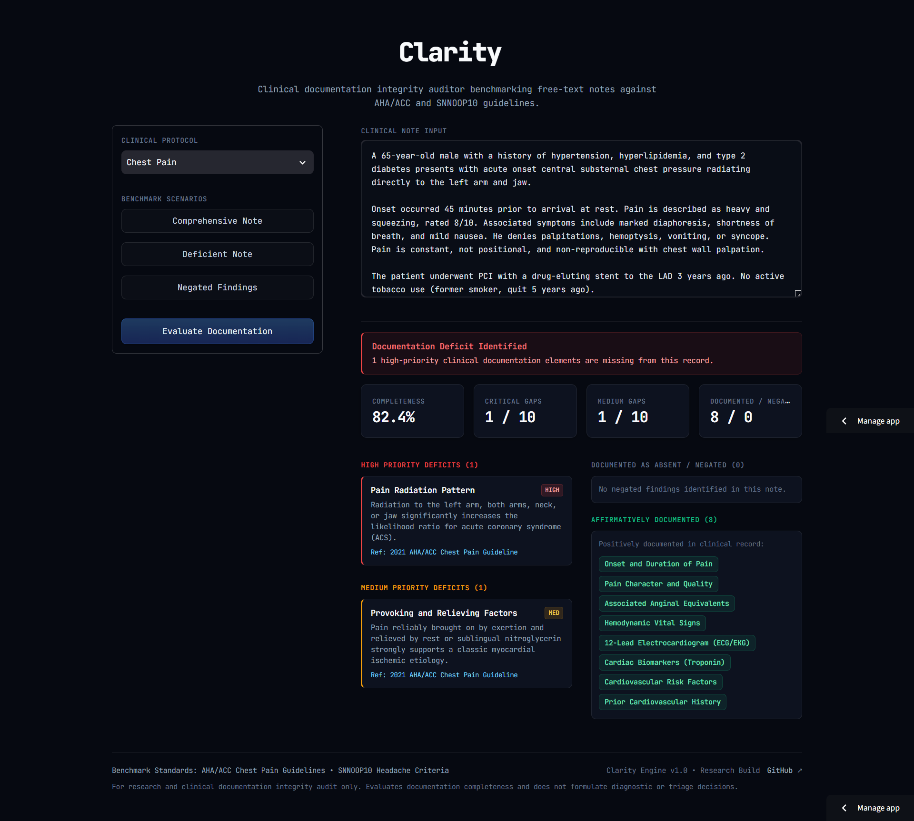

<div align="center">

# Clarity
**Clinical Documentation Integrity & Guideline Audit Engine**

<p>
  An evidence-based clinical documentation integrity engine that audits free-text medical records against authoritative clinical society guidelines to detect documentation omissions without diagnosing patients.
</p>

[](https://www.python.org/)
[](https://clarity-3sdzzb4ebw9kkq92j7x5dq.streamlit.app)
[](https://docs.pytest.org/)
[]()
[](LICENSE)

<p>
  <strong><a href="https://clarity-3sdzzb4ebw9kkq92j7x5dq.streamlit.app" target="_blank" rel="noopener noreferrer">Live Demo ↗</a></strong>
</p>

<a href="https://clarity-3sdzzb4ebw9kkq92j7x5dq.streamlit.app" target="_blank" rel="noopener noreferrer">
  
</a>

</div>

---

> [!CAUTION]
> ### Clinical Research & Educational Disclaimer
> **Clarity is an academic engineering and research portfolio demonstration, NOT an approved medical diagnostic or clinical decision-support system (CDSS).**  
> It does not evaluate patient pathology, propose differential diagnoses, formulate triage recommendations, or prescribe therapeutics. Its sole scope is evaluating the **completeness of clinical documentation** against codified medical society checklists. It has not undergone clinical trials and must never be utilized in active clinical care pathways.

---

## Executive Overview

In emergency and acute outpatient settings, incomplete clinical documentation represents a critical patient safety risk, a frequent cause of diagnostic delay, and a primary vulnerability in medical-legal audit. While generative Large Language Models (LLMs) are often proposed for medical note analysis, they suffer from stochasticity, hallucinations, unpredictable inference latency, high token costs, and black-box uninterpretability.

**Clarity** resolves this by providing a deterministic, transparent, and ultra-fast documentation audit engine. It ingests unstructured free-text clinical notes, matches concepts against standardized medical guideline checklists, detects clause-bounded symptom negations, and generates an actionable integrity report detailing:
- **Completeness Score (%):** Weighted coverage of required documentation items.
- **Critical & Medium Deficits:** Specific missing clinical parameters mapped to their medical rationale and guideline citation.
- **Documented Findings:** Segmented into affirmative findings and explicitly documented negative/negated findings.

---

## Key Capabilities

- 🩺 **Evidence-Based Guideline Grounding**: Codified knowledge bases strictly derived from published standards:
  - **2021 AHA/ACC Chest Pain Guideline** (American Heart Association / American College of Cardiology).
  - **SNNOOP10 Headache Red Flag Criteria** (European & International Headache Society standards).
- 🔍 **Clause-Bounded Clinical Negation Detection**: Implements a localized sliding-window heuristic that isolates negated observations (e.g., *"denies shortness of breath"*, *"no radiation to jaw"*), preventing documented absences from being misclassified as missing documentation while excluding them from affirmative points.
- ⚖️ **Weighted Clinical Risk Scoring**: Prioritizes life-threatening parameters (`HIGH` priority = 2 points, e.g., ECG or troponin in acute chest pain) over routine historical elements (`MEDIUM` priority = 1 point).
- ⚡ **Zero-Inference Footprint**: Runs locally with 100% deterministic reproducibility in $<10\text{ ms}$, requiring no GPU hardware, external APIs, or heavy ML dependencies.
- 🖥️ **Modern Clinical Dashboard Interface**: Built with a sleek dark theme featuring monospace typography, high-contrast clinical status indicators, and responsive layout via Streamlit.

---

## Codified Clinical Guidelines

Clarity stores its knowledge bases in structured, version-controlled JSON (`data/checklists.json`). Each parameter includes clinical priority, keyword taxonomies, medical rationales, and formal guideline citations.

### 1. Acute Chest Pain (`chest_pain`)
*Source: 2021 AHA/ACC/ASE/CHEST/SAEM/SCCT/SCMR Guideline for the Evaluation and Diagnosis of Chest Pain.*

| Parameter | Priority | Weight | Clinical Rationale & Guideline Citation |
| :--- | :---: | :---: | :--- |
| **Pain Character** | `HIGH` | 2 pts | Distinguishes ischemic (pressure/tightness) from non-ischemic etiologies. *(2021 AHA/ACC Chest Pain Guideline)* |
| **Pain Location & Radiation** | `HIGH` | 2 pts | Radiation to neck, jaw, or arms significantly elevates Acute Coronary Syndrome likelihood. *(2021 AHA/ACC Chest Pain Guideline)* |
| **Onset & Acuity** | `HIGH` | 2 pts | Abrupt 'thunderclap' or tearing onset flags aortic dissection. *(2021 AHA/ACC Chest Pain Guideline)* |
| **Electrocardiogram (ECG)** | `HIGH` | 2 pts | Mandatory within 10 minutes of presentation to detect STEMI. *(2021 AHA/ACC Chest Pain Guideline)* |
| **Cardiac Biomarkers (Troponin)** | `HIGH` | 2 pts | Essential to confirm or exclude acute myocardial injury. *(2021 AHA/ACC Chest Pain Guideline)* |
| **Associated Symptoms** | `MEDIUM` | 1 pt | Diaphoresis, dyspnea, nausea are secondary anginal equivalents. *(2021 AHA/ACC Chest Pain Guideline)* |
| **Provoking / Relieving Factors**| `MEDIUM` | 1 pt | Exertional aggravation or rest relief guides ischemic vs pleuritic etiology. *(2021 AHA/ACC Chest Pain Guideline)* |
| **Vital Signs** | `MEDIUM` | 1 pt | Hemodynamic stability directly governs triage priority. *(2021 AHA/ACC Chest Pain Guideline)* |
| **Cardiovascular Risk Factors** | `MEDIUM` | 1 pt | Hypertension, diabetes, smoking, hyperlipidemia inform pre-test probability. *(2021 AHA/ACC Chest Pain Guideline)* |
| **Prior Cardiac History** | `MEDIUM` | 1 pt | Known CAD, prior PCI/CABG markedly shifts clinical suspicion. *(2021 AHA/ACC Chest Pain Guideline)* |

### 2. Acute Headache (`headache`)
*Source: SNNOOP10 Headache Red Flag Criteria (International Headache Society & consensus guidelines).*

| Parameter | Priority | Weight | Clinical Rationale & Guideline Citation |
| :--- | :---: | :---: | :--- |
| **Onset & Speed (Thunderclap)** | `HIGH` | 2 pts | Reaching peak within 1 minute mandates immediate exclusion of Subarachnoid Hemorrhage. *(SNNOOP10 Headache Red Flags)* |
| **Systemic Symptoms (Fever/Weight)**| `HIGH` | 2 pts | Suggests meningitis, encephalitis, or giant cell arteritis. *(SNNOOP10 Headache Red Flags)* |
| **Neurologic Deficits** | `HIGH` | 2 pts | Motor/sensory/cranial nerve deficits flag intracranial space-occupying lesions. *(SNNOOP10 Headache Red Flags)* |
| **Neoplasm History** | `HIGH` | 2 pts | Significantly increases pre-test probability of brain metastasis. *(SNNOOP10 Headache Red Flags)* |
| **Pain Character & Severity** | `MEDIUM` | 1 pt | Characterizes primary vs secondary presentation; 'worst headache of life'. *(SNNOOP10 Headache Red Flags)* |
| **Older Age at Onset (>50)** | `MEDIUM` | 1 pt | New headache onset in older adults raises concern for Giant Cell Arteritis or mass. *(SNNOOP10 Headache Red Flags)* |
| **Postural / Positional Triggers**| `MEDIUM` | 1 pt | Positional variation indicates intracranial hypotension or hypertension. *(SNNOOP10 Headache Red Flags)* |
| **Precipitated by Valsalva** | `MEDIUM` | 1 pt | Cough, bend, exertion onset indicates posterior fossa pathology or Chiari malformation. *(SNNOOP10 Headache Red Flags)* |
| **Papilledema** | `MEDIUM` | 1 pt | Critical physical sign of elevated intracranial pressure. *(SNNOOP10 Headache Red Flags)* |
| **Immunosuppression / HIV** | `MEDIUM` | 1 pt | High risk for opportunistic CNS infections and abscesses. *(SNNOOP10 Headache Red Flags)* |

---

## Audit & Scoring Methodology

### 1. Extraction & Negation Pipeline
1. **Keyword Pattern Matching:** Case-insensitive substring and synonym matching scans clinical text against the checklist dictionary.
2. **Clause-Bounded Negation Detection (`src/negation.py`):**
   - When a keyword matches, the preceding context window (up to 6 words) is inspected.
   - The scan is strictly bounded by clause boundaries (`.`, `!`, `?`, `;`, `\n`).
   - Trigger dictionary contains 9 clinical negation triggers:
     `"denies", "denied", "denying", "no", "without", "negative for", "ruled out", "not", "absence of"`
3. **Classification:**
   - **`found`**: Affirmatively documented in note $\rightarrow$ awards completeness points.
   - **`negated`**: Explicitly documented as absent/denied $\rightarrow$ tracked as a documented negative finding; does not award affirmative points.
   - **`missing`**: Not detected in note $\rightarrow$ flagged as a documentation gap with priority tier.

### 2. Mathematical Completeness Formulation

$$\text{Completeness Score} = \left( \frac{\sum_{i \in \text{Present}} \text{Weight}_i}{\sum_{j \in \text{Checklist}} \text{Weight}_j} \right) \times 100$$

Where:
- $\text{Weight} = 2$ for `HIGH` priority items.
- $\text{Weight} = 1$ for `MEDIUM` priority items.
- Explicitly negated items are isolated in clinical coverage reports rather than penalized or falsely scored.

---

## System Architecture

```text
Clarity/
├── data/
│   ├── checklists.json       # Guideline knowledge base (AHA/ACC, SNNOOP10) with versioning
│   └── ground_truth.json     # Curated physician annotations for 60 clinical benchmark checkpoints
├── src/
│   ├── checklist.py          # Typed dataclasses & JSON loader with schema validation
│   ├── negation.py           # Clause-bounded clinical negation sliding-window detector
│   ├── extractor.py          # Keyword matcher tracking status (found, negated, missing)
│   ├── analyzer.py           # Weighted completeness calculation & audit report generation
│   ├── evaluate.py           # Ground-truth benchmark evaluation & confusion matrix generator
│   └── sample_notes.py       # 6 standardized clinical fixtures (complete, deficient, negated)
├── tests/
│   ├── test_checklist.py     # Schema validation and condition registry unit tests
│   ├── test_extractor.py     # Affirmative, negated, and absent extraction unit tests
│   ├── test_analyzer.py      # Mathematical scoring and deficit aggregation unit tests
│   └── test_evaluate.py      # Benchmark evaluation matrix verification unit tests
├── app.py                    # Interactive Streamlit clinical review dashboard
├── favicon.svg               # Custom monospace branded application favicon
├── requirements.txt          # Pinned dependency ranges for reproducible deployment
├── LICENSE                   # MIT Open Source License
└── README.md
```

### Data Flow Diagram

```text
       ┌────────────────────────┐
       │  data/checklists.json  │
       └───────────┬────────────┘
                   │  (ChecklistField Dataclasses)
                   ▼
         [ src/checklist.py ]
                   │
                   ├───────────────────────────────────┐
                   │                                   │
                   ▼                                   ▼
         [ Raw Clinical Note ]               [ src/negation.py ]
                   │                                   │
                   └───────────────► [ src/extractor.py ] ◄─┘
                                           │
                                           │  (ExtractionResult: found/negated/missing)
                                           ▼
                                  [ src/analyzer.py ]
                                           │
                        ┌──────────────────┴──────────────────┐
                        ▼                                     ▼
             [ CLI Analysis Report ]               [ Streamlit UI (app.py) ]
```

---

## Quickstart

### 1. Installation

```bash
# Clone the repository
git clone https://github.com/mariiammaysara/Clarity.git
cd Clarity

# Install dependencies (Python 3.10+)
pip install -r requirements.txt
```

### 2. Run Automated Test Suite

All 12 test cases run in $<0.1\text{ s}$:

```bash
pytest -v
```

```text
============================= 12 passed in 0.05s ==============================
```

### 3. Launch the Interactive Dashboard

```bash
streamlit run app.py
```

Open your browser at `http://localhost:8501` to access the interactive clinical interface.

### 4. Run CLI Audit Matrix

Evaluate the preloaded benchmark fixtures across all conditions directly from the terminal:

```bash
python src/sample_notes.py
```

Or run an audit on a single sample clinical note:

```bash
python src/analyzer.py
```

### 5. Run Ground-Truth Benchmark Evaluation

Run the manual benchmark evaluation against ground truth:

```bash
python -m src.evaluate
```

---

## Benchmark Clinical Scenarios

Clarity includes 6 calibrated clinical fixtures in `src/sample_notes.py` representing three realistic documentation profiles across both clinical conditions:

| Scenario ID | Condition | Profile Description | Expected Audit Finding |
| :--- | :--- | :--- | :--- |
| `chest_pain_complete` | Chest Pain | ED physician note with complete workup. | **100% Completeness** • 0 Deficits |
| `chest_pain_deficient` | Chest Pain | Triage note lacking troponin, ECG, and vitals. | **Critical Gaps Identified** • High Priority Alerts |
| `chest_pain_negated` | Chest Pain | History explicitly denying radiation & dyspnea. | **Documented Negatives** • Isolated Coverage |
| `headache_complete` | Headache | Complete neurological & red-flag workup. | **100% Completeness** • 0 Deficits |
| `headache_deficient` | Headache | Brief note omitting onset speed, fever, papilledema.| **Critical Gaps Identified** • Subarachnoid Risk |
| `headache_negated` | Headache | Comprehensive note denying thunderclap & deficits. | **Documented Negatives** • Red Flags Documented Absent |

---

## Design Decisions

- **Rule-Based Engine Over Generative LLMs**: Prioritized deterministic, inspectable keyword extraction over black-box LLMs to ensure reproducible audits, instant execution speed (<10 ms), and zero external API dependencies or token costs.
- **Weighted Clinical Scoring (HIGH = 2 pts, MEDIUM = 1 pt)**: Reflects acute clinical triage reality, where omitting critical life-threat rule-outs (e.g., troponin or ECG in acute coronary syndrome) carries far greater risk than background historical elements.
- **Dedicated Clause-Bounded Negation (`src/negation.py`)**: Decouples negation detection from keyword searching, ensuring documented negative findings (e.g., *"denies radiation to left arm"*) do not earn completeness points while preventing them from being flagged as missing omissions.
- **Zero Heavy NLP Frameworks**: Built using standard Python data structures and standard-library modules (`dataclasses`, `pathlib`, `re`, `json`) without PyTorch or spaCy overhead, ensuring maximum portability and transparency.

---

## Evaluation

Clarity was evaluated across the 6 standardized clinical fixtures against a curated ground truth (`data/ground_truth.json`) manually reviewed and annotated by the project developer rather than synthetically generated:

| Class / Metric | Precision | Recall | F1-Score | Support |
| :--- | :---: | :---: | :---: | :---: |
| **`found`** | **100.0%** | **88.2%** | **93.8%** | 17 |
| **`negated`** | **100.0%** | **91.7%** | **95.7%** | 12 |
| **`missing`** | **91.2%** | **100.0%** | **95.4%** | 31 |
| **Overall Accuracy** | **95.00%** (57 / 60) | — | — | 60 |

### Clinical Significance of Evaluation Metrics
Achieving **100.0% Precision** on both `found` and `negated` classes signifies **zero false positives**—the auditor never erroneously reports an absent finding as present, nor does it misclassify an affirmed symptom as negated. Conversely, a **Recall below 100%** on these same classes (88.2% for `found`, 91.7% for `negated`) indicates occasional **false negatives** where clinical parameters documented in non-standard phrasing escape dictionary detection. In clinical documentation integrity audit, high precision is paramount to avoid offering clinicians false reassurance, while taxonomy expansion systematically eliminates remaining false negatives.

Complete confusion matrix breakdowns and per-checkpoint error diagnostics are reproducible via:
```bash
python -m src.evaluate
```

---

## Known Limitations

1. **Heuristic Negation Scope**: Negation detection relies on a localized pre-negation word window (default: 6 words) bounded by sentence terminators. It does not perform full syntactic dependency parsing and cannot resolve post-negation (e.g., *"chest pain was denied"*) or complex double negations.
2. **Keyword Substring Collisions**: Substring matching risks collisions when a short term is embedded within another compound phrase (for instance, the keyword `"pressure"` matching inside `"blood pressure"`).
3. **Documentation Completeness vs. Clinical Truth**: Clarity verifies whether concepts were *written* in the note. It cannot judge clinical accuracy, verify whether diagnostic tests were performed correctly, or evaluate patient pathology.
4. **Keyword Coverage Narrowness**: Finite keyword lists inherently generate false negatives when clinical information is documented using syntactic variations diverging from exact checklist entries. For instance, in testing of the *"Pain Radiation Pattern"* field, the rule-based extractor failed to match across three synonymous formulations of the same clinical finding (`"left arm radiation"` vs. `"radiation to left arm"` vs. `"radiating...to the left arm"`), representing an ongoing limitation in capturing uncodified syntactic phrasing.

---

## Technical Stack

- **Language**: Python 3.10+ (Standard Library: `dataclasses`, `pathlib`, `typing`, `re`, `json`)
- **Frontend Framework**: Streamlit (Custom dark healthtech theme with monospace typography)
- **Testing & Quality Assurance**: pytest
- **Version Control**: Git & GitHub

---

## Academic Context

Developed as an independent portfolio project demonstrating competencies in applied healthcare informatics, clinical natural language processing, and medical documentation integrity. Created as part of academic preparation for competitive Master's programs in Medical Artificial Intelligence (including the Erasmus Mundus Joint Master Degree in Medical Imaging and Applications - MAIA).

---

## License

This project is licensed under the [MIT License](LICENSE) — see the LICENSE file for details.
